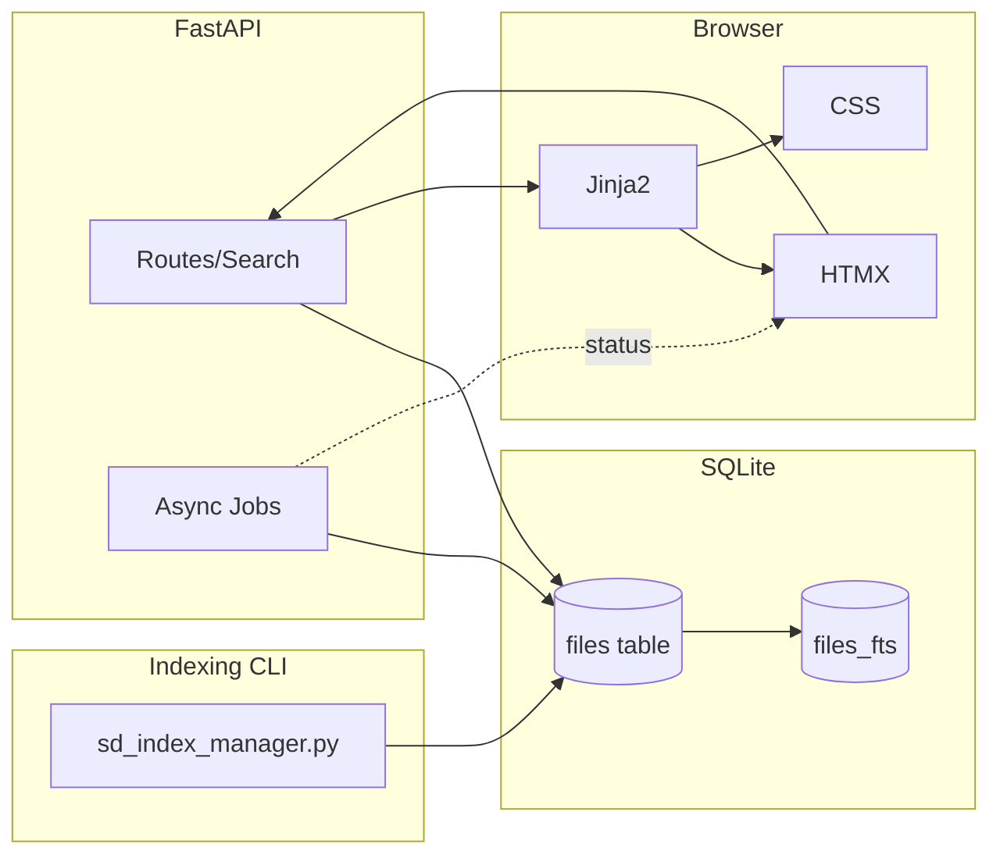

# Project Architecture

The indexer populates and updates the primary `files` table; FTS triggers maintain the `files_fts` virtual table when supported. The web app provides search, pagination, semantic select-all, and asynchronous bulk operations (move / copy / delete) with progress polling.
