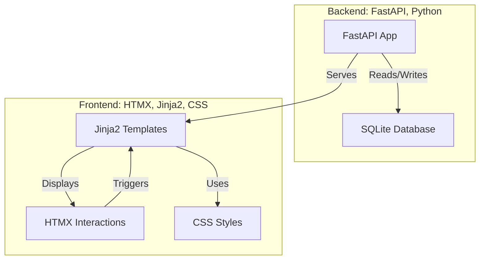

# Project Architecture



The indexer populates and updates the primary `files` table; FTS triggers maintain the `files_fts` virtual table when supported. The web app provides search, pagination, semantic select-all, and asynchronous bulk operations (move / copy / delete) with progress polling.

## Modular Core (Post-Refactor)
Core logic previously in `sd_index_manager.py` now lives in a lightweight package:

```
sd_index/
    paths.py        # DB_PATH, flags
    db_schema.py    # init_db, ensure_fts, migrations
    db_repair.py    # integrity + repair helpers
    indexing.py     # FAST / FULL indexing implementation
    extraction.py   # Generation metadata + LoRA extraction
    duplicates.py   # de_duplicate_by_hash
    cleanup.py      # clear_database
    progress.py     # spinner / progress abstraction
    webui_launcher.py # run_webui wrapper
    cli.py          # interactive menu
```

`sd_index_manager.py` remains as a facade re-exporting the public API to keep tests and existing scripts working unchanged.
