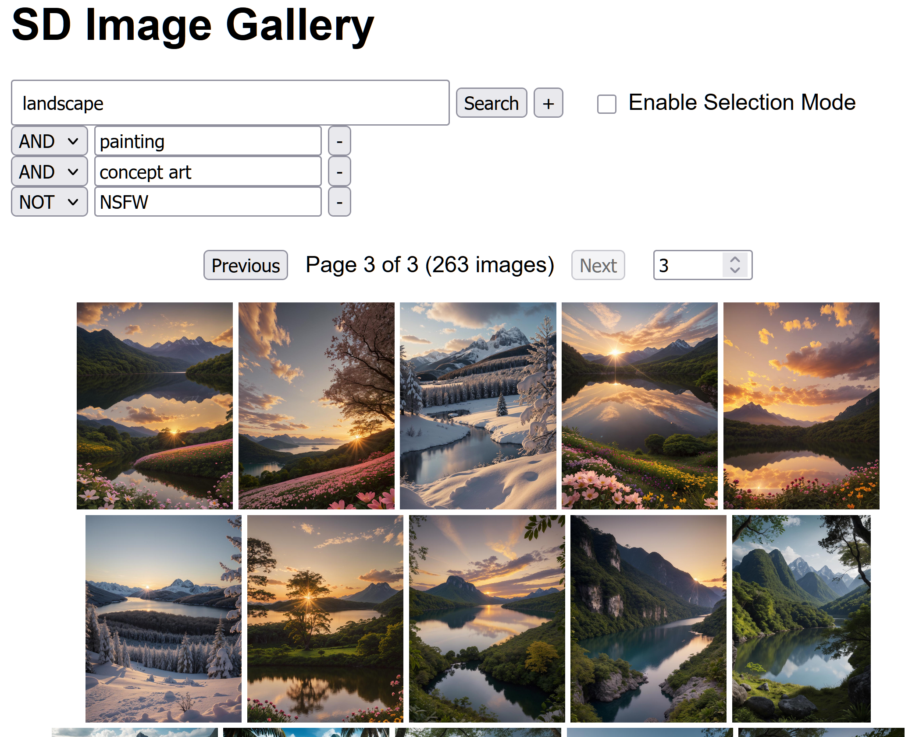

# SD Image Gallery

Fast, file‑system based image metadata index + minimal web gallery.



```mermaid
%%{init: {'theme':'neutral','flowchart':{'curve':'basis'}} }%%
flowchart LR
  subgraph CLI[Indexing CLI]
    IDX[sd_index_manager.py]\nScan & Parse
  end
  subgraph DB[(SQLite + FTS5?)]
    TBL[(files table)]
    FTS[(files_fts)]
  end
  subgraph API[FastAPI App]
    ROUTES[Routes / Search]
    JOBS[Async Jobs\n(Bulk Ops)]
  end
  subgraph UI[Browser]
    HTMX[HTMX + JS]
    TPL[Jinja2 Templates]
    CSS[CSS]
  end

  IDX -->|insert / update| DB
  ROUTES --> DB
  JOBS --> DB
  HTMX --> ROUTES
  ROUTES --> TPL --> HTMX
  TPL --> CSS
  JOBS -. status polling .-> HTMX
  DB --> ROUTES
```

## What It Does
Indexes common image formats into a single SQLite database (with optional FTS5) and serves a lightweight FastAPI + HTMX UI to search, browse, preview metadata, and perform safe bulk file operations.

## Key Features (Concise)
- Incremental indexing (hash + size + times + dimensions + parsed metadata)
- Optional FTS5 accelerated search (falls back to LIKE)
- Multi-term search builder (AND / OR / NOT, LEN operators, empty `{}`)
- Responsive gallery + metadata modal (copy path / JSON)
- Semantic “Select All” (query-scope) bulk Move / Copy / Delete
- Async background file operations with progress polling
- Collision‑safe naming on move/copy; DB + FTS kept in sync
- Pagination with jump links (up to 200 per page)

## Quick Start
```bash
python sd_index_manager.py   # choose option 1 to index, option 3 to launch UI
# or directly
uvicorn webui.main:app --reload
```
Open http://127.0.0.1:8000

## Using the UI
1. Search: enter a main term; add extra terms (AND/OR/NOT). Use `LEN>0`, `{}` for empty metadata.
2. Click a thumbnail for full view + metadata panel.
3. Enable Selection Mode → (optionally) Select All → perform Move / Copy / Delete.
4. During large operations a status bar shows live progress.

## Bulk Operations (Semantic Select All)
- Global select-all applies to the entire current query, not just the visible page.
- Operations stream in batches; progress endpoint: `/file_operation_status/{job_id}`.
- Copy inserts new DB rows immediately (no re-index needed).

## Project Structure (Top-Level)
```
sd_index_manager.py    # CLI: init, index, launch web UI
webui/                 # FastAPI app, templates, static assets
  main.py              # Routes, async job system, file ops
  search_utils.py      # Search WHERE clause builder
  templates/           # Jinja2 templates (gallery, items)
  static/              # CSS
PROJECT_STRUCTURE.md   # Diagram
requirements.txt
README.md
```

## Indexing Notes
- Re-run the indexer to pick up new or modified files; unchanged entries are skipped.
- DB auto-migrates new columns; FTS5 triggers maintain search index.
- Integrity check + self-repair attempt before indexing.

## Configuration Touchpoints
- Allowed file-operation roots: `ALLOWED_ROOTS` in `webui/main.py`.
- Page size limit: `MAX_PAGE_SIZE` in `webui/main.py`.
- Batch sizes / job behavior: constants near file op code.

## Requirements
See `requirements.txt` (FastAPI, Pillow, sd-parsers, etc.). Ensure your Python has SQLite with FTS5 if you want full-text search.

## Development
- Single-process, no external services beyond SQLite file.
- Modify search behavior centrally in `search_utils.py`.
- Add routes or UI tweaks with minimal reload (uvicorn --reload).

## License
Add your preferred license text here.

---
Concise by design: for a visual component overview see `PROJECT_STRUCTURE.md`.
