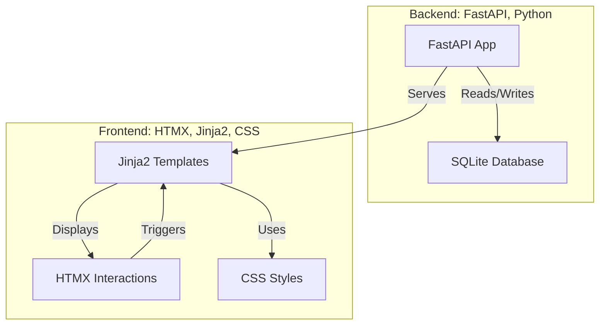

# SD Image Gallery

## Overview

This project indexes images and their metadata into a SQLite database and provides a FastAPI powered web UI to browse, search, and manage the images. It supports incremental re-indexing, optional FTS5 accelerated search, file operations, and a metadata / full-size image modal with copy utilities.

## Project Structure Diagram

Below is a Mermaid chart representing the main components and relationships in this project.  
For a larger view, see [PROJECT_STRUCTURE.md](PROJECT_STRUCTURE.md).

## Features

Core
- Incremental indexing of images (PNG, JPG/JPEG, WEBP, BMP, TIFF) with:
  - SHA256 content hash
  - File size, mtime/ctime
  - Width / height (via Pillow, best-effort)
  - Parsed metadata (via sd-parsers) serialized to JSON
- Automatic detection and creation of FTS5 virtual table (if SQLite build supports it) with triggers to keep metadata in sync.
- Automatic database integrity check and self-repair attempt before indexing (corrupted DB moved aside and rebuilt).

Search
- Unified search builder supporting:
  - Simple substring search (LIKE) when FTS not available
  - FTS5 powered term / phrase search (quoted automatically) when available
  - LEN operators: e.g. `LEN>0`, `LEN=0` (length of metadata JSON text)
  - Exact empty metadata: `{}`
  - Multiple field terms combined with AND / OR / NOT (NOT treated as unary AND NOT)
- Pagination with configurable page & page_size (capped at 200) and total count display.

Web UI
- Responsive gallery grid with lazy-loaded thumbnails.
- Full-size image modal shows:
  - Large preview (cache-busted by file hash param)
  - Copyable file path bar
  - Scrollable formatted metadata JSON panel with copy + hide/show toggle
- Distinct metadata field discovery endpoint (`/metadata_fields`) used to populate dynamic multi-term search UI.
- Selection mode with bulk file operations and dynamic toolbar.

File Operations (constrained & validated)
- Move: relocates image on disk and updates DB path (within allowed roots)
- Copy: duplicates file on disk (copy not auto-indexed until next run)
- Delete: removes file from disk and deletes DB row
- Root path whitelisting prevents operations outside configured allowed roots.

Performance & Robustness
- Batch INSERT/UPDATE commits for scalability
- WAL journal mode + NORMAL synchronous for balance of speed & durability
- Memory/temp PRAGMA tuning (best-effort) and FTS prefix indexes for faster prefix searching
- Automatic hash query parameter for immutable browser caching of unchanged images

Accessibility / UX
- Keyboard activation (Enter/Space) on thumbnails
- Escape closes modal
- Buttons have aria labels / focusable elements
- Copy feedback state changes ("Copied")

Extensibility
- Centralized search utility (`webui/search_utils.py`) for consistent logic across endpoints
- Schema auto-migration of new columns (size, times, dimensions) on startup

Planned / Possible Enhancements (not yet implemented)
- Structured / collapsible metadata key browser
- Dimension-based search filters (width / height comparisons)
- Advanced grouping & precedence in search (parentheses)
- Authentication / authorization for destructive operations
- Structured logging & metrics

## Usage

1. Initialize / ensure schema: `python sd_index_manager.py` (auto creates DB if missing).
2. Choose option 1 to index a root folder (recursive). Re-run to incrementally update (skips unchanged files by size+mtime).
3. Option 3 launches the Web UI (or run `uvicorn webui.main:app --reload`).
4. Use the search bar:
  - Enter a main query + additional fields with AND/OR/NOT.
  - Use `{}` for images with explicitly empty metadata.
  - Use `LEN=0` or `LEN>0` style expressions for length-based filtering.
  - When FTS active: multi-word terms become phrase searches unless you include operators / wildcards.
5. Click a thumbnail for full-size view + metadata + file path (copy buttons available).
6. Toggle selection mode to bulk Move / Copy / Delete. (Moves update DB; copies require re-index to appear; deletes remove DB rows.)

Re-indexing Safety
- Integrity check runs before indexing; malformed DBs are backed up and rebuilt automatically.
- Interrupted runs are resilient thanks to batch commits and WAL.

## Development

- The backend is built with FastAPI.
- The frontend uses Jinja2 templates and HTMX for interactivity.
- SQLite is used for metadata storage.

## Notes

- Copies created via the UI are not tracked in the database until you re-run the indexer over their destination folder.
- Deletions and moves are immediate and reflected after page refresh (UI reload or manual navigation).
- FTS is optional; if your SQLite build lacks FTS5, searches fall back to LIKE (slower, fewer capabilities).
- Large bulk selections are capped (50k IDs per operation) to prevent excessive memory usage.
- Page size limited to 200 to avoid excessive payload sizes.

## Requirements

See `requirements.txt`. Ensure Pillow has image format support you need.

## Development Tips

- Modify search logic once in `webui/search_utils.py` to affect all endpoints.
- Add new DB columns by altering `init_db()`; it will attempt migration without destructively recreating.
- Consider adding structured logging (e.g., `structlog` or Python `logging`) for production use.

## License

(Add your license here.)
