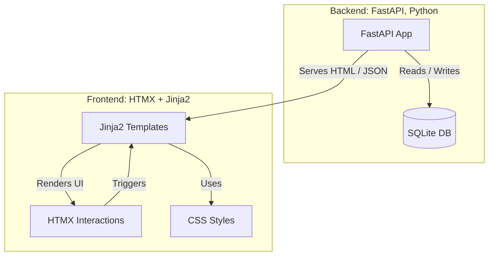

# SD Image Gallery

Fast, file‑system based image metadata index + minimal web gallery.


## Architecture


## Overview
Indexes common image formats into a single SQLite database (with optional FTS5) and serves a lightweight FastAPI + HTMX UI to search, browse, preview metadata, and perform safe bulk file operations.

## Highlights
- Incremental indexing (hash + size + times + dimensions + parsed metadata)
- Optional FTS5 accelerated search (falls back to LIKE)
- Multi-term search builder (AND / OR / NOT, LEN operators, empty `{}`)
- Responsive gallery + metadata modal (copy path / JSON)
- Semantic “Select All” (query-scope) bulk Move / Copy / Delete
- Async background file operations with progress polling
- Collision‑safe naming on move/copy; DB + FTS kept in sync
- Pagination with jump links (up to 200 per page)
- Automatic extraction of SD generation parameters & LoRA usage (models + lora_usages tables) + cleaned prompt FTS
- Consolidated integration test suite (primary coverage lives across `test_integration/` modules)

## Quick Start
```bash
python sd_index_manager.py   # Menu: 1 Index, 2 Check/Repair, 3 Clear DB, 4 Web UI, 5 De-duplicate
# or directly launch the Web UI
uvicorn webui.main:app --reload
```
Open http://127.0.0.1:8000

First run prompts for a directory to index. After initial FAST run you can:
1. Re-run (FAST) to add new files quickly.
2. Set env `SD_INDEX_FULL_REFRESH=1` or choose FULL mode to re-hash & detect modified content.
3. Launch the Web UI from the menu (or via uvicorn) at any time.

## Using the UI
1. Search: enter a main term; add extra terms (AND/OR/NOT). Use `LEN>0`, `{}` for empty metadata.
2. Click a thumbnail for full view + metadata panel.
3. Enable Selection Mode → (optionally) Select All → perform Move / Copy / Delete.
4. During large operations a status bar shows live progress.

## Bulk Operations (Semantic Select All)
- Global select-all applies to the entire current query, not just the visible page.
- Operations stream in batches; progress endpoint: `/file_operation_status/{job_id}`.
- Copy inserts new DB rows immediately (no re-index needed).

## De-duplicate by hash (CLI)
- From `python sd_index_manager.py`, choose option 5: "De-duplicate files by hash (delete duplicates)".
- Finds exact byte-identical duplicates via stored SHA-256 (`file_hash`).
- Keeps one file per hash group and deletes the rest (disk + DB).
- Confirmation prompt; operation is destructive.

## Project Structure
Refactored into a modular package (`sd_index`) while keeping the facade `sd_index_manager.py` for backward compatibility.
```
sd_index/
  __init__.py           # Re-exports public API
  paths.py              # DB paths & flags
  progress.py           # Progress/spinner utilities
  db_schema.py          # Schema & FTS management
  db_repair.py          # Integrity + repair helpers
  scanning.py           # Recursive file discovery & object serialization
  indexing.py           # FAST / FULL indexing implementation
  extraction.py         # Prompt / model / LoRA metadata extraction
  duplicates.py         # Hash-based duplicate deletion
  cleanup.py            # clear_database
  webui_launcher.py     # run_webui wrapper
  cli.py                # Interactive menu
sd_index_manager.py     # Backward-compatible facade (imports from sd_index)
webui/
  main.py               # FastAPI routes & async jobs
  search_utils.py       # Search WHERE builder
  templates/            # Jinja2 templates
  static/               # CSS / placeholder assets
test_integration/       # Integration tests
requirements.txt
PROJECT_STRUCTURE.md
README.md
```

## Indexing & Extraction Notes
- Re-run the indexer to pick up new or modified files; unchanged entries are skipped.
- DB auto-migrates new columns; FTS5 triggers maintain search index.
- After indexing, prompt/model extraction runs automatically (disable with env `SD_DISABLE_EXTRACTION=1`).
- Extraction populates `models` (1:1) and `lora_usages` (N:1) using only embedded metadata (no external calls).
- Cleaned prompts indexed into `prompts_fts` for fast prompt term searches (unioned with file/path FTS queries).
- Summary endpoint: `GET /extraction_summary` returns counts and top LoRA usage.
- Integrity check + self-repair attempt before indexing.
 - You can run a manual integrity check and repair anytime via menu option 2.

## Configuration
Environment variables / tunables:

| Variable | Purpose | Default |
|----------|---------|---------|
| `SD_INDEX_FULL_REFRESH` | Set to `1` to force full (hash+stat) refresh instead of FAST add-only | `0` |
| `SD_ALLOWED_ROOTS` | os.pathsep-separated list of root dirs allowed for destructive ops (delete/move). Empty => unrestricted | (unset) |
| `TEST_IMAGE_DIR` | (Tests) override location of sample images | `test_images/` |

Code constants:
- Allowed file-operation roots fallback: `ALLOWED_ROOTS` logic in `webui/main.py`.
- Page size cap: `MAX_PAGE_SIZE` in `webui/main.py`.
- Async job batch sizes / polling: see file operation helpers in `webui/main.py`.

## Requirements
See `requirements.txt` (FastAPI, Pillow, sd-parsers, etc.). Ensure your Python has SQLite with FTS5 if you want full-text search.

## Development
- Single-process, no external services beyond SQLite file.
- Modify search behavior centrally in `search_utils.py`.
- Add routes or UI tweaks with minimal reload (uvicorn --reload).

### Testing
All integration coverage lives in `test_integration/test_combined_integration.py` (consolidated from several former files). Run:
Run the integration suite (multiple focused modules) with:
```bash
pytest -q test_integration
```
Perf timings append to `test_integration/perf_log.txt` each run. Use `TEST_IMAGE_DIR` to point at a custom small image corpus for quicker cycles.

### Known Warnings
Starlette template deprecation warning (parameter order) appears during tests; future cleanup will update `TemplateResponse` usage.

### Security / Destructive Ops
Destructive file operations (move / copy / delete) are unrestricted by default for local, single‑user usage. In multi‑user or networked scenarios set:

| Variable | Effect |
|----------|--------|
| `SD_ALLOWED_ROOTS` | `os.pathsep`‑separated list of root directories permitted for destructive ops (restricts source & destination). |
| `SD_DISABLE_DESTRUCTIVE_OPS` | Set to `1` to disable move/copy/delete endpoints (read‑only mode). |
| `SD_REQUIRE_ALLOWED_ROOTS` | Set to `1` to force configuration of `SD_ALLOWED_ROOTS`; without it destructive ops return HTTP 400. |

### Hash Refresh Strictness
Full refresh mode (env `SD_INDEX_FULL_REFRESH=1`) skips re‑hashing files whose `(mtime,size)` pair is unchanged for speed. To force hashing every file (detecting rare timestamp/size forgery), set `SD_INDEX_STRICT_FULL=1`.

## License
Add your preferred license text here.

---
See `PROJECT_STRUCTURE.md` for a focused component diagram.
