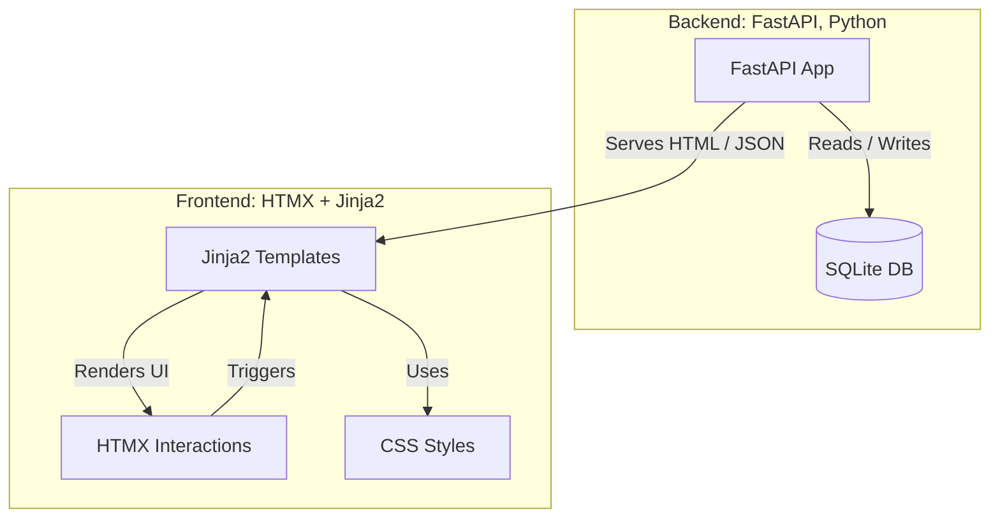

# SD Image Gallery

A fast, file-system based image metadata indexer with a minimal web gallery interface for browsing and managing Stable Diffusion generated images.


## Features

- **Fast Incremental Indexing**: Hash-based detection of new and modified files
- **Rich Metadata Extraction**: Automatic extraction of SD generation parameters and LoRA usage
- **Full-Text Search**: FTS5-powered search with multi-term query builder (AND/OR/NOT operations)
- **Responsive Web UI**: HTMX-powered interface with thumbnail gallery and metadata viewer
- **Bulk Operations**: Semantic "Select All" for query-scoped move/copy/delete operations
- **Async File Operations**: Background processing with real-time progress updates
- **Duplicate Detection**: Hash-based duplicate file detection and removal
- **Database Integrity**: Self-healing database with automatic repair capabilities

## Architecture


## Overview
Indexes common image formats into a single SQLite database (with optional FTS5) and serves a lightweight FastAPI + HTMX UI to search, browse, preview metadata, and perform safe bulk file operations.

## Highlights
- Incremental indexing (hash + size + times + dimensions + parsed metadata)
- Optional FTS5 accelerated search (falls back to LIKE)
- Multi-term search builder (AND / OR / NOT, LEN operators, empty `{}`)
- Responsive gallery + metadata modal (copy path / JSON)
- Semantic “Select All” (query-scope) bulk Move / Copy / Delete
- Async background file operations with progress polling
- Collision‑safe naming on move/copy; DB + FTS kept in sync
- Pagination with jump links (up to 200 per page)
- Automatic extraction of SD generation parameters & LoRA usage (models + lora_usages tables) + cleaned prompt FTS
- Consolidated integration test suite (primary coverage lives across `test_integration/` modules)

## Quick Start

### Installation
```bash
# Clone the repository
git clone https://github.com/chickenanarchy/sd_image_gallery.git
cd sd_image_gallery

# Install dependencies
pip install -r requirements.txt
```

### Basic Usage
```bash
# Interactive menu with all options
python sd_index_manager.py

# Direct web UI launch
uvicorn webui.main:app --reload --host 127.0.0.1 --port 8000
```

Open http://127.0.0.1:8000 in your browser.

### First Run
1. **Index your images**: Choose option 1 from the menu to index a directory
2. **Launch Web UI**: Choose option 4 or run uvicorn directly
3. **Start browsing**: Search, filter, and manage your image collection

### Indexing Modes
- **FAST mode** (default): Only processes new files, very quick for updates
- **FULL mode**: Re-processes all files, use when you need to detect changes
  ```bash
  SD_INDEX_FULL_REFRESH=1 python sd_index_manager.py
  ```

## Web UI Features

### Search & Browse
- **Multi-term search**: Combine terms with AND/OR/NOT operators
- **Special operators**: Use `LEN>0` for files with metadata, `{}` for empty metadata
- **Full-text search**: Search within prompts, file paths, and metadata
- **Responsive gallery**: Thumbnail grid with pagination (up to 200 items per page)

### Metadata Viewer
- **Rich metadata display**: View complete SD generation parameters
- **LoRA usage tracking**: See which LoRAs were used and their weights
- **Copy functionality**: Easily copy file paths or complete metadata as JSON
- **Model information**: View model names and generation settings

### Bulk Operations
- **Selection mode**: Enable to select multiple images
- **Semantic "Select All"**: Apply to entire query results, not just current page
- **Async operations**: Move, copy, or delete files with real-time progress
- **Safe operations**: Collision-safe naming and database consistency maintained

### File Management
- **Duplicate detection**: Find and remove exact duplicates by hash
- **Safe moves/copies**: Automatic collision handling with database sync
- **Progress tracking**: Real-time status for long-running operations

## Project Structure

The project has been refactored into a modular package structure for better maintainability:

```
sd_image_gallery/
├── sd_index/                   # Core indexing package
│   ├── __init__.py            # Public API exports
│   ├── paths.py               # Database paths & configuration
│   ├── progress.py            # Progress reporting utilities
│   ├── db_schema.py           # Database schema & FTS management
│   ├── db_repair.py           # Integrity checking & repair
│   ├── scanning.py            # File discovery & serialization
│   ├── indexing.py            # Indexing implementation (FAST/FULL)
│   ├── extraction.py          # SD metadata & LoRA extraction
│   ├── duplicates.py          # Hash-based duplicate removal
│   ├── cleanup.py             # Database cleanup utilities
│   ├── webui_launcher.py      # Web UI launch wrapper
│   └── cli.py                 # Interactive command-line menu
├── webui/                     # Web interface
│   ├── main.py               # FastAPI application & routes
│   ├── search_utils.py       # Search query builder
│   ├── templates/            # Jinja2 HTML templates
│   └── static/               # CSS & static assets
├── test_integration/          # Integration test suite
│   ├── db/                   # Database lifecycle tests
│   ├── extraction/           # Metadata extraction tests
│   ├── file_ops/             # File operation tests
│   ├── fts/                  # Full-text search tests
│   ├── launch/               # Web UI launch tests
│   ├── thumbnails/           # Thumbnail generation tests
│   └── webui/                # Web UI integration tests
├── test_images/              # Sample images for testing
├── sd_index_manager.py       # Backward-compatible main script
├── requirements.txt          # Python dependencies
├── pytest.ini              # Test configuration
└── README.md                # This file
```

## Command Line Interface

The main script provides an interactive menu:

```bash
python sd_index_manager.py
```

**Menu Options:**
1. **Index files** - Scan and index images from a directory
2. **Check/Repair database** - Verify database integrity and attempt repairs
3. **Clear database** - Remove all indexed data (keeps database structure)
4. **Launch Web UI** - Start the web interface
5. **De-duplicate files** - Find and remove duplicate images by hash

### Duplicate Removal
The de-duplication feature:
- Uses SHA-256 hashes to find exact duplicates
- Keeps one file per hash group, deletes the rest
- Updates database automatically to maintain consistency
- Requires confirmation before deletion (destructive operation)

## Development & Testing

### Running Tests
The project includes comprehensive integration tests:

```bash
# Run all integration tests
pytest test_integration/

# Run with coverage
pytest --cov=sd_index test_integration/

# Run specific test modules
pytest test_integration/webui/
pytest test_integration/extraction/
```

### Test Structure
- **Integration tests**: Cover real workflows and interactions between components
- **Sample data**: `test_images/` contains sample images for testing
- **Performance logging**: Test runs append timing data to `test_integration/perf_log.txt`
- **Isolated testing**: Tests use temporary databases to avoid affecting your data
## Advanced Configuration

### Environment Variables

| Variable | Purpose | Default |
|----------|---------|---------|
| `SD_INDEX_FULL_REFRESH` | Force full refresh (re-hash all files) instead of incremental | `0` |
| `SD_INDEX_STRICT_FULL` | Force hashing every file even if size/mtime unchanged | `0` |
| `SD_DISABLE_EXTRACTION` | Skip metadata extraction after indexing | `0` |
| `SD_ALLOWED_ROOTS` | Restrict file operations to specific root directories | (unset) |
| `SD_DISABLE_DESTRUCTIVE_OPS` | Disable move/copy/delete operations (read-only mode) | `0` |
| `SD_REQUIRE_ALLOWED_ROOTS` | Require `SD_ALLOWED_ROOTS` to be set for destructive ops | `0` |
| `TEST_IMAGE_DIR` | Override test image directory for testing | `test_images/` |

### Security Considerations

For multi-user or networked deployments:

- Set `SD_ALLOWED_ROOTS` to restrict file operations to safe directories
- Use `SD_DISABLE_DESTRUCTIVE_OPS=1` for read-only access
- Consider running behind a reverse proxy with authentication
- Database file should be protected with appropriate file permissions

### Performance Tuning

- **Page size**: Web UI pagination defaults to 50 items, max 200 per page
- **Batch processing**: Bulk operations process files in configurable batches
- **FTS optimization**: Full-text search automatically falls back to LIKE queries if FTS5 unavailable
- **Database maintenance**: Regular integrity checks help maintain optimal performance

## Technical Details

### Database Schema
- **files**: Main table with file paths, hashes, dimensions, timestamps
- **files_fts**: FTS5 virtual table for fast text search
- **models**: Extracted model information from SD metadata
- **lora_usages**: Many-to-one relationship tracking LoRA usage
- **prompts_fts**: Cleaned prompt text for efficient prompt searching

### Metadata Extraction
- Supports common SD metadata formats (PNG info, EXIF, etc.)
- Extracts generation parameters, model names, LoRA weights
- Cleans and indexes prompts for fast searching
- No external API calls - works entirely from embedded metadata

### File Operations
- All operations maintain database consistency
- Collision-safe naming prevents overwrites
- Async processing with WebSocket-style progress updates
- Database triggers keep FTS indexes synchronized

## Requirements

- Python 3.8+ with SQLite support
- FTS5 extension for full-text search (falls back to LIKE queries if unavailable)

### Dependencies
See `requirements.txt` for the complete list:
- **FastAPI**: Web framework for the API
- **Uvicorn**: ASGI server
- **Jinja2**: Template engine
- **sd-parsers**: Stable Diffusion metadata parsing
- **Pillow**: Image processing
- **alive-progress**: Progress bars
- **pytest**: Testing framework

```bash
pip install -r requirements.txt
```

## Contributing

1. Fork the repository
2. Create a feature branch: `git checkout -b feature-name`
3. Make your changes and add tests
4. Run the test suite: `pytest test_integration/`
5. Commit your changes: `git commit -am "Add feature"`
6. Push to the branch: `git push origin feature-name`
7. Submit a pull request

## Known Issues

- Starlette template deprecation warnings may appear during tests (will be addressed in future updates)
- FTS5 availability depends on SQLite compilation options in your Python installation

## Roadmap

- [ ] Enhanced thumbnail generation and caching
- [ ] Additional metadata format support
- [ ] Export/import functionality for collections
- [ ] Advanced filtering and sorting options
- [ ] API documentation and OpenAPI schema
- [ ] Docker containerization

## License

This project is open source. Please add your preferred license.

---

For detailed component information, see `PROJECT_STRUCTURE.md`.
