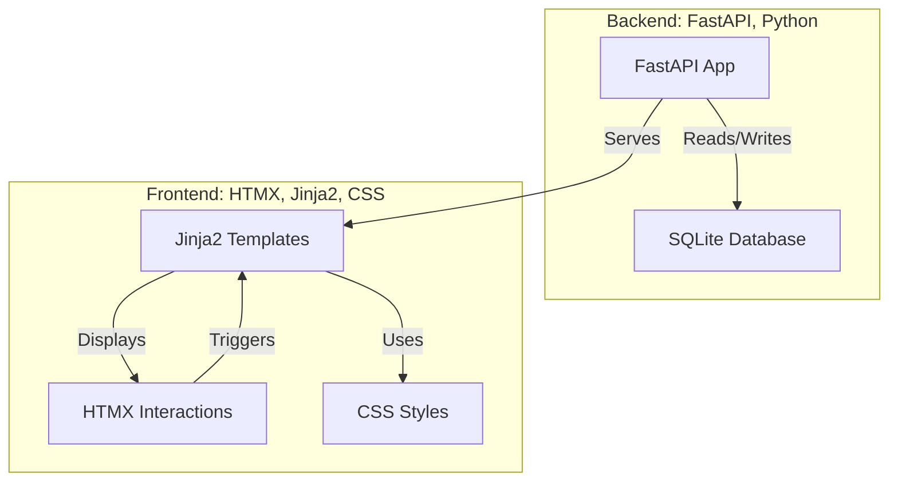

# SD Image Gallery

## Overview

This project indexes images and their metadata into a SQLite database and provides a web UI to browse, search, and manage the images.

## Project Structure Diagram

Below is a Mermaid chart representing the main components and relationships in this project.  
For a larger view, see [PROJECT_STRUCTURE.md](PROJECT_STRUCTURE.md).

## Features

- Index images from a directory, extracting metadata.
- Search images by metadata with support for:
  - Partial matches using LIKE.
  - Exact matches for empty metadata (`{}`).
  - Searching for images with NULL metadata by typing `NULL`.
- Web UI gallery with pagination and metadata display.
- File operations from the UI:
  - Move: Moves files on disk and updates database paths.
  - Copy: Copies files on disk but does NOT add copies to the database (copies are extraneous until indexed).
  - Delete: Deletes files from disk and removes their records from the database.
- Gallery refreshes automatically after file operations to reflect changes.

## Usage

1. Run `sd_index_manager.py` to index images.
2. Launch the web UI via the menu option or run `uvicorn webui.main:app --reload`.
3. Use the search bar to find images by metadata.
   - To find images with empty metadata, search for `{}`.
   - To find images with NULL metadata, search for `NULL`.
4. Enable selection mode in the gallery to perform file operations.

## Development

- The backend is built with FastAPI.
- The frontend uses Jinja2 templates and HTMX for interactivity.
- SQLite is used for metadata storage.

## Notes

- Copies created via the UI are not tracked in the database and will not appear in the gallery unless their folder is indexed later.
- Deletions and moves update the database and filesystem accordingly.
- The gallery automatically reloads after file operations to keep the UI in sync.
